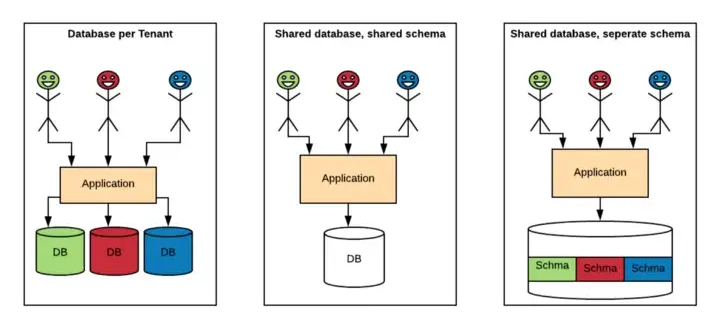

# Spring Boot Multi-tenant Demo

There are Three way to create multi-tenant application architecture.

1. Database per Tenant: Each Tenant has its own database and is isolated from other tenants.
2. Shared Database, Shared Schema: All Tenants share a database and tables. Every table has a Column with the Tenant
3. Shared Database, Separate Schema: All Tenants share a database, but have their own database schemas and tables.
   Identifier, that shows the owner of the row.



This is a Spring Boot multi-tenant sample application which supports database par tenant i.e. first approach.

## Main Classes/Files

- `MasterService`  
  Used to map database to the tenant
  > Note: There should be public database for all the tenant to hold the tenant information and mapping
- `Application`  
  It has spring init method and datasource bean
- `CustomRoutingDataSource`  
  It has `determineCurrentLookupKey` method which decides tenant for HTTP request.
  > Note: Identifier of tenant is `tenantId` and currently only two tenants are hard coded 1) `tenantId1` 2) `tenantId2`
  which
  should be replaced by random string or UUID.
- `application.properties`  
  To hold application level config

## Database

Need to create databases manually for all the tenant and create table with bellow script

```sql
CREATE TABLE `employee` (
  `employeeId` int(11) NOT NULL AUTO_INCREMENT,
  `employeeName` varchar(255) DEFAULT NULL
  PRIMARY KEY (`employeeId`)
) ENGINE=InnoDB AUTO_INCREMENT=1 DEFAULT CHARSET=latin1;
```

Add different dummy data in both database's table

## Demo

- Get employee list form `tenantId1`

```shell
curl 'http://localhost:8080/employee/list?tenantId=tenantId1' \
  -H 'Accept: text/html,application/xhtml+xml,application/xml;q=0.9,image/avif,image/webp,image/apng,*/*;q=0.8' \
  -H 'Accept-Language: en-GB,en' \
  -H 'Connection: keep-alive' \
  -H 'Sec-Fetch-Dest: document' \
  -H 'Sec-Fetch-Mode: navigate' \
  -H 'Sec-Fetch-Site: none' \
  -H 'Sec-Fetch-User: ?1' \
  -H 'Sec-GPC: 1' \
  -H 'Upgrade-Insecure-Requests: 1' \
  -H 'User-Agent: Mozilla/5.0 (X11; Linux x86_64) AppleWebKit/537.36 (KHTML, like Gecko) Chrome/108.0.0.0 Safari/537.36' \
  --compressed
```

- Get employee list form `tenantId2`

```shell
curl 'http://localhost:8080/employee/list?tenantId=tenantId2' \
  -H 'Accept: text/html,application/xhtml+xml,application/xml;q=0.9,image/avif,image/webp,image/apng,*/*;q=0.8' \
  -H 'Accept-Language: en-GB,en' \
  -H 'Connection: keep-alive' \
  -H 'Sec-Fetch-Dest: document' \
  -H 'Sec-Fetch-Mode: navigate' \
  -H 'Sec-Fetch-Site: none' \
  -H 'Sec-Fetch-User: ?1' \
  -H 'Sec-GPC: 1' \
  -H 'Upgrade-Insecure-Requests: 1' \
  -H 'User-Agent: Mozilla/5.0 (X11; Linux x86_64) AppleWebKit/537.36 (KHTML, like Gecko) Chrome/108.0.0.0 Safari/537.36' \
  --compressed
```

## Future enhancement

- Multi-Tenancy model
  using [Hibernate multi-tenancy support](https://docs.jboss.org/hibernate/orm/4.2/devguide/en-US/html/ch16.html).
- We can have public database which is common for all the tenant to store database configuration for all the tenant and
  to map high level entity with tenant enterprise or organization.